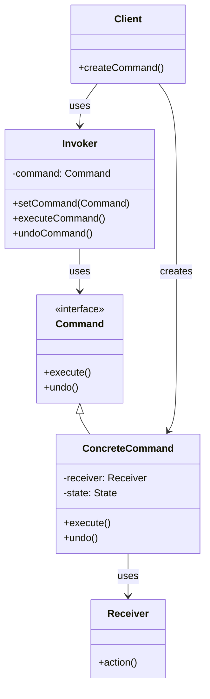

# 📝 Command Pattern

## 📋 Definición

El patrón **Command** encapsula una solicitud como un objeto, permitiendo parametrizar clientes con diferentes solicitudes, hacer cola de solicitudes, registrar solicitudes y soportar operaciones de deshacer.

## 🎯 Propósito

- **Encapsular** solicitudes como objetos
- **Parametrizar** clientes con diferentes solicitudes
- **Hacer cola** de solicitudes
- **Soportar** operaciones de deshacer
- **Desacoplar** el emisor del receptor

## 🔍 Cuándo Usar

### ✅ **Situaciones Apropiadas:**
- **Operaciones de deshacer** (undo/redo)
- **Hacer cola** de solicitudes
- **Logging** de operaciones
- **Macros** o scripts
- **Sistemas de transacciones**

### ❌ **Cuándo NO usar:**
- Cuando las operaciones son muy simples
- Cuando no necesitas funcionalidades avanzadas
- Cuando el rendimiento es crítico

---

## 🏗️ Estructura del Patrón

### 📊 Diagrama UML



### 🔧 Componentes

1. **Command**: Interface para comandos
2. **ConcreteCommand**: Implementación específica del comando
3. **Receiver**: Objeto que ejecuta la operación
4. **Invoker**: Clase que ejecuta comandos
5. **Client**: Clase que crea y configura comandos

---

## 💻 Implementación en C++

### 🔧 **Implementación Básica**

```cpp
#include <memory>
#include <iostream>
#include <string>
#include <vector>
#include <stack>

// Command interface
class Command {
public:
    virtual ~Command() = default;
    virtual void execute() = 0;
    virtual void undo() = 0;
    virtual std::string getDescription() const = 0;
};

// Receiver
class Light {
private:
    bool isOn;
    int brightness;
    
public:
    Light() : isOn(false), brightness(0) {}
    
    void turnOn() {
        isOn = true;
        brightness = 100;
        std::cout << "Light is ON" << std::endl;
    }
    
    void turnOff() {
        isOn = false;
        brightness = 0;
        std::cout << "Light is OFF" << std::endl;
    }
    
    void setBrightness(int level) {
        brightness = level;
        std::cout << "Light brightness set to " << level << "%" << std::endl;
    }
    
    bool getIsOn() const { return isOn; }
    int getBrightness() const { return brightness; }
};

// Concrete Commands
class LightOnCommand : public Command {
private:
    std::unique_ptr<Light> light;
    
public:
    LightOnCommand(std::unique_ptr<Light> light) : light(std::move(light)) {}
    
    void execute() override {
        light->turnOn();
    }
    
    void undo() override {
        light->turnOff();
    }
    
    std::string getDescription() const override {
        return "Turn light ON";
    }
};

class LightOffCommand : public Command {
private:
    std::unique_ptr<Light> light;
    
public:
    LightOffCommand(std::unique_ptr<Light> light) : light(std::move(light)) {}
    
    void execute() override {
        light->turnOff();
    }
    
    void undo() override {
        light->turnOn();
    }
    
    std::string getDescription() const override {
        return "Turn light OFF";
    }
};

class LightBrightnessCommand : public Command {
private:
    std::unique_ptr<Light> light;
    int newBrightness;
    int previousBrightness;
    
public:
    LightBrightnessCommand(std::unique_ptr<Light> light, int brightness) 
        : light(std::move(light)), newBrightness(brightness), previousBrightness(0) {}
    
    void execute() override {
        previousBrightness = light->getBrightness();
        light->setBrightness(newBrightness);
    }
    
    void undo() override {
        light->setBrightness(previousBrightness);
    }
    
    std::string getDescription() const override {
        return "Set light brightness to " + std::to_string(newBrightness);
    }
};

// Invoker
class RemoteControl {
private:
    std::unique_ptr<Command> command;
    std::stack<std::unique_ptr<Command>> commandHistory;
    
public:
    void setCommand(std::unique_ptr<Command> cmd) {
        command = std::move(cmd);
    }
    
    void pressButton() {
        if (command) {
            command->execute();
            // Guardar comando para undo
            commandHistory.push(std::move(command));
        } else {
            std::cout << "No command set!" << std::endl;
        }
    }
    
    void pressUndo() {
        if (!commandHistory.empty()) {
            auto lastCommand = std::move(commandHistory.top());
            commandHistory.pop();
            lastCommand->undo();
        } else {
            std::cout << "No commands to undo!" << std::endl;
        }
    }
    
    void showHistory() {
        std::cout << "Command History:" << std::endl;
        std::stack<std::unique_ptr<Command>> temp = commandHistory;
        int i = 1;
        while (!temp.empty()) {
            std::cout << i++ << ". " << temp.top()->getDescription() << std::endl;
            temp.pop();
        }
    }
};
```

### 🚀 **Implementación con Macro Commands**

```cpp
// Macro Command
class MacroCommand : public Command {
private:
    std::vector<std::unique_ptr<Command>> commands;
    
public:
    void addCommand(std::unique_ptr<Command> command) {
        commands.push_back(std::move(command));
    }
    
    void execute() override {
        std::cout << "Executing macro command..." << std::endl;
        for (auto& command : commands) {
            command->execute();
        }
    }
    
    void undo() override {
        std::cout << "Undoing macro command..." << std::endl;
        // Undo en orden inverso
        for (auto it = commands.rbegin(); it != commands.rend(); ++it) {
            (*it)->undo();
        }
    }
    
    std::string getDescription() const override {
        return "Macro command with " + std::to_string(commands.size()) + " commands";
    }
};
```

---

## 🎯 Ejemplos Prácticos

### 🎮 **Sistema de Juegos**

```cpp
// Game Object
class GameObject {
private:
    int x, y;
    std::string name;
    
public:
    GameObject(const std::string& name, int x, int y) : name(name), x(x), y(y) {}
    
    void move(int dx, int dy) {
        x += dx;
        y += dy;
        std::cout << name << " moved to (" << x << ", " << y << ")" << std::endl;
    }
    
    void setPosition(int newX, int newY) {
        x = newX;
        y = newY;
        std::cout << name << " position set to (" << x << ", " << y << ")" << std::endl;
    }
    
    int getX() const { return x; }
    int getY() const { return y; }
    std::string getName() const { return name; }
};

// Game Commands
class MoveCommand : public Command {
private:
    std::unique_ptr<GameObject> gameObject;
    int dx, dy;
    int previousX, previousY;
    
public:
    MoveCommand(std::unique_ptr<GameObject> obj, int dx, int dy) 
        : gameObject(std::move(obj)), dx(dx), dy(dy), previousX(0), previousY(0) {}
    
    void execute() override {
        previousX = gameObject->getX();
        previousY = gameObject->getY();
        gameObject->move(dx, dy);
    }
    
    void undo() override {
        gameObject->setPosition(previousX, previousY);
    }
    
    std::string getDescription() const override {
        return "Move " + gameObject->getName() + " by (" + std::to_string(dx) + ", " + std::to_string(dy) + ")";
    }
};

class AttackCommand : public Command {
private:
    std::unique_ptr<GameObject> attacker;
    std::unique_ptr<GameObject> target;
    int damage;
    
public:
    AttackCommand(std::unique_ptr<GameObject> attacker, std::unique_ptr<GameObject> target, int damage) 
        : attacker(std::move(attacker)), target(std::move(target)), damage(damage) {}
    
    void execute() override {
        std::cout << attacker->getName() << " attacks " << target->getName() << " for " << damage << " damage" << std::endl;
    }
    
    void undo() override {
        std::cout << "Undo attack: " << attacker->getName() << " heals " << target->getName() << " for " << damage << " health" << std::endl;
    }
    
    std::string getDescription() const override {
        return attacker->getName() + " attacks " + target->getName();
    }
};

// Game Command Manager
class GameCommandManager {
private:
    std::stack<std::unique_ptr<Command>> commandHistory;
    std::vector<std::unique_ptr<Command>> commandQueue;
    
public:
    void executeCommand(std::unique_ptr<Command> command) {
        command->execute();
        commandHistory.push(std::move(command));
    }
    
    void undoLastCommand() {
        if (!commandHistory.empty()) {
            auto lastCommand = std::move(commandHistory.top());
            commandHistory.pop();
            lastCommand->undo();
        }
    }
    
    void queueCommand(std::unique_ptr<Command> command) {
        commandQueue.push_back(std::move(command));
    }
    
    void executeAllQueuedCommands() {
        for (auto& command : commandQueue) {
            command->execute();
            commandHistory.push(std::move(command));
        }
        commandQueue.clear();
    }
    
    void clearHistory() {
        while (!commandHistory.empty()) {
            commandHistory.pop();
        }
    }
};
```

### 📝 **Sistema de Editor de Texto**

```cpp
// Text Editor
class TextEditor {
private:
    std::string content;
    size_t cursorPosition;
    
public:
    TextEditor() : cursorPosition(0) {}
    
    void insertText(const std::string& text) {
        content.insert(cursorPosition, text);
        cursorPosition += text.length();
        std::cout << "Inserted: " << text << std::endl;
    }
    
    void deleteText(size_t length) {
        if (cursorPosition >= length) {
            content.erase(cursorPosition - length, length);
            cursorPosition -= length;
            std::cout << "Deleted " << length << " characters" << std::endl;
        }
    }
    
    void setCursorPosition(size_t position) {
        cursorPosition = std::min(position, content.length());
        std::cout << "Cursor set to position " << cursorPosition << std::endl;
    }
    
    std::string getContent() const { return content; }
    size_t getCursorPosition() const { return cursorPosition; }
};

// Text Editor Commands
class InsertTextCommand : public Command {
private:
    std::unique_ptr<TextEditor> editor;
    std::string text;
    size_t position;
    
public:
    InsertTextCommand(std::unique_ptr<TextEditor> editor, const std::string& text, size_t position) 
        : editor(std::move(editor)), text(text), position(position) {}
    
    void execute() override {
        editor->setCursorPosition(position);
        editor->insertText(text);
    }
    
    void undo() override {
        editor->setCursorPosition(position + text.length());
        editor->deleteText(text.length());
    }
    
    std::string getDescription() const override {
        return "Insert '" + text + "' at position " + std::to_string(position);
    }
};

class DeleteTextCommand : public Command {
private:
    std::unique_ptr<TextEditor> editor;
    std::string deletedText;
    size_t position;
    
public:
    DeleteTextCommand(std::unique_ptr<TextEditor> editor, size_t position, size_t length) 
        : editor(std::move(editor)), position(position) {
        // Capturar texto que se va a eliminar
        std::string content = editor->getContent();
        if (position < content.length()) {
            deletedText = content.substr(position, std::min(length, content.length() - position));
        }
    }
    
    void execute() override {
        editor->setCursorPosition(position);
        editor->deleteText(deletedText.length());
    }
    
    void undo() override {
        editor->setCursorPosition(position);
        editor->insertText(deletedText);
    }
    
    std::string getDescription() const override {
        return "Delete '" + deletedText + "' at position " + std::to_string(position);
    }
};
```

---

## ⚠️ Problemas y Soluciones

### 🚨 **Problemas Comunes**

#### 1. **Memory Management**
```cpp
// ❌ PROBLEMA: Raw pointers
class Command {
    Receiver* receiver;  // Raw pointer
public:
    Command(Receiver* rec) : receiver(rec) {}
    ~Command() { delete receiver; }  // ¿Quién es el dueño?
};

// ✅ SOLUCIÓN: Smart pointers
class Command {
    std::unique_ptr<Receiver> receiver;
public:
    Command(std::unique_ptr<Receiver> rec) : receiver(std::move(rec)) {}
    // Destructor automático con RAII
};
```

#### 2. **Comandos Complejos**
```cpp
// ❌ PROBLEMA: Comando muy complejo
class ComplexCommand : public Command {
public:
    void execute() override {
        // 100 líneas de código complejo
        // Difícil de mantener y testear
    }
};

// ✅ SOLUCIÓN: Dividir en comandos más pequeños
class SimpleCommand1 : public Command { /* ... */ };
class SimpleCommand2 : public Command { /* ... */ };
class MacroCommand : public Command {
    std::vector<std::unique_ptr<Command>> commands;
public:
    void execute() override {
        for (auto& cmd : commands) {
            cmd->execute();
        }
    }
};
```

#### 3. **Undo/Redo Complejo**
```cpp
// ❌ PROBLEMA: Undo complejo
class ComplexCommand : public Command {
public:
    void undo() override {
        // Lógica compleja para deshacer
        // Difícil de implementar correctamente
    }
};

// ✅ SOLUCIÓN: Memento pattern
class Memento {
private:
    std::string state;
public:
    Memento(const std::string& state) : state(state) {}
    std::string getState() const { return state; }
};

class Originator {
private:
    std::string state;
public:
    Memento createMemento() { return Memento(state); }
    void restoreMemento(const Memento& memento) { state = memento.getState(); }
};
```

---

## 🎯 Ventajas y Desventajas

### ✅ **Ventajas:**
- **Desacoplamiento**: Emisor no conoce receptor
- **Undo/Redo**: Fácil implementar operaciones de deshacer
- **Logging**: Fácil registrar operaciones
- **Macros**: Combinar comandos en secuencias
- **Cola**: Hacer cola de operaciones

### ❌ **Desventajas:**
- **Complejidad**: Puede ser excesiva para casos simples
- **Memory**: Almacenar estado para undo
- **Performance**: Overhead de encapsulación
- **Debugging**: Difícil rastrear el flujo de comandos

---

## 🧪 Testing con Command

### 🔧 **Mocking Commands**

```cpp
// Mock Command para testing
class MockCommand : public Command {
public:
    MOCK_METHOD(void, execute, (), (override));
    MOCK_METHOD(void, undo, (), (override));
    MOCK_METHOD(std::string, getDescription, (), (const, override));
};

// Test
TEST(CommandPattern, ExecuteCommand) {
    auto mockCommand = std::make_unique<MockCommand>();
    auto invoker = std::make_unique<RemoteControl>();
    
    EXPECT_CALL(*mockCommand, execute()).Times(1);
    EXPECT_CALL(*mockCommand, getDescription()).WillOnce(Return("Test Command"));
    
    invoker->setCommand(std::move(mockCommand));
    invoker->pressButton();
}
```

---

## 🚀 Alternativas al Command

### 1. **Function Objects**
```cpp
class FunctionCommand : public Command {
private:
    std::function<void()> executeFunc;
    std::function<void()> undoFunc;
    
public:
    FunctionCommand(std::function<void()> exec, std::function<void()> undo) 
        : executeFunc(exec), undoFunc(undo) {}
    
    void execute() override { executeFunc(); }
    void undo() override { undoFunc(); }
};
```

### 2. **Lambda Commands**
```cpp
class LambdaCommand : public Command {
private:
    std::function<void()> executeFunc;
    std::function<void()> undoFunc;
    
public:
    LambdaCommand(std::function<void()> exec, std::function<void()> undo) 
        : executeFunc(exec), undoFunc(undo) {}
    
    void execute() override { executeFunc(); }
    void undo() override { undoFunc(); }
};

// Uso
auto command = std::make_unique<LambdaCommand>(
    []() { std::cout << "Execute" << std::endl; },
    []() { std::cout << "Undo" << std::endl; }
);
```

### 3. **Event System**
```cpp
class EventSystem {
private:
    std::vector<std::function<void()>> listeners;
    
public:
    void subscribe(std::function<void()> listener) {
        listeners.push_back(listener);
    }
    
    void publish() {
        for (auto& listener : listeners) {
            listener();
        }
    }
};
```

---

## 🎯 Cuándo Usar Command en 42

### ✅ **Proyectos Apropiados:**
- **Cub3D**: Comandos de movimiento y acciones
- **Philosophers**: Comandos de sincronización
- **Minishell**: Comandos de shell
- **Webserv**: Comandos de servidor

### ❌ **Proyectos Inapropiados:**
- **Libft**: Funciones de utilidad
- **Get Next Line**: Lectura de archivos
- **Printf**: Formateo de strings

---

## 📚 Recursos Adicionales

### 📖 **Lecturas Recomendadas:**
- [Refactoring Guru - Command](https://refactoring.guru/es/design-patterns/command)
- [Modern C++ Design](https://www.oreilly.com/library/view/modern-c-design/0201704315/)
- [C++ Core Guidelines](https://isocpp.github.io/CppCoreGuidelines/)

### 🎯 **Próximos Pasos:**
1. Implementa un sistema de comandos para un editor
2. Crea comandos para un sistema de juegos
3. Prueba con operaciones de undo/redo
4. Estudia alternativas como Event System

---

*El Command es perfecto para sistemas que necesitan operaciones de deshacer y cola de comandos. ¡Úsalo para encapsular solicitudes! 📝*
