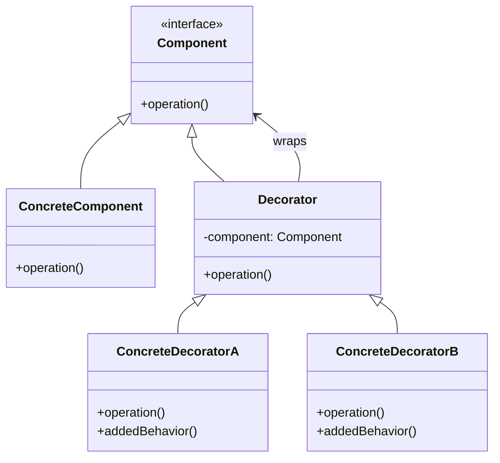

# 🎨 Decorator Pattern

## 📋 Definición

El patrón **Decorator** permite añadir nuevas funcionalidades a objetos existentes de forma dinámica, sin alterar su estructura. Es una alternativa flexible a la herencia para extender funcionalidad.

## 🎯 Propósito

- **Añadir funcionalidad** dinámicamente a objetos
- **Componer** comportamientos de forma flexible
- **Evitar** explosión de subclases
- **Mantener** el principio de responsabilidad única

## 🔍 Cuándo Usar

### ✅ **Situaciones Apropiadas:**
- **Añadir funcionalidad** sin modificar código existente
- **Combinar** múltiples comportamientos
- **Evitar** herencia múltiple compleja
- **Funcionalidad opcional** que se puede activar/desactivar
- **Sistemas de plugins** o extensiones

### ❌ **Cuándo NO usar:**
- Cuando la funcionalidad es fija y no cambia
- Cuando la herencia simple es suficiente
- Cuando el rendimiento es crítico

---

## 🏗️ Estructura del Patrón

### 📊 Diagrama UML



### 🔧 Componentes

1. **Component**: Interface común para objetos y decoradores
2. **ConcreteComponent**: Implementación base del objeto
3. **Decorator**: Clase abstracta que envuelve componentes
4. **ConcreteDecorator**: Implementación específica del decorador

---

## 💻 Implementación en C++

### 🔧 **Implementación Básica**

```cpp
#include <memory>
#include <iostream>
#include <string>

// Component interface
class Coffee {
public:
    virtual ~Coffee() = default;
    virtual std::string getDescription() const = 0;
    virtual double getCost() const = 0;
};

// Concrete Component
class SimpleCoffee : public Coffee {
public:
    std::string getDescription() const override {
        return "Simple Coffee";
    }
    
    double getCost() const override {
        return 2.0;
    }
};

// Base Decorator
class CoffeeDecorator : public Coffee {
protected:
    std::unique_ptr<Coffee> coffee;
    
public:
    CoffeeDecorator(std::unique_ptr<Coffee> coffee) : coffee(std::move(coffee)) {}
    
    std::string getDescription() const override {
        return coffee->getDescription();
    }
    
    double getCost() const override {
        return coffee->getCost();
    }
};

// Concrete Decorators
class MilkDecorator : public CoffeeDecorator {
public:
    MilkDecorator(std::unique_ptr<Coffee> coffee) : CoffeeDecorator(std::move(coffee)) {}
    
    std::string getDescription() const override {
        return coffee->getDescription() + ", Milk";
    }
    
    double getCost() const override {
        return coffee->getCost() + 0.5;
    }
};

class SugarDecorator : public CoffeeDecorator {
public:
    SugarDecorator(std::unique_ptr<Coffee> coffee) : CoffeeDecorator(std::move(coffee)) {}
    
    std::string getDescription() const override {
        return coffee->getDescription() + ", Sugar";
    }
    
    double getCost() const override {
        return coffee->getCost() + 0.2;
    }
};

class WhipDecorator : public CoffeeDecorator {
public:
    WhipDecorator(std::unique_ptr<Coffee> coffee) : CoffeeDecorator(std::move(coffee)) {}
    
    std::string getDescription() const override {
        return coffee->getDescription() + ", Whip";
    }
    
    double getCost() const override {
        return coffee->getCost() + 0.7;
    }
};

class VanillaDecorator : public CoffeeDecorator {
public:
    VanillaDecorator(std::unique_ptr<Coffee> coffee) : CoffeeDecorator(std::move(coffee)) {}
    
    std::string getDescription() const override {
        return coffee->getDescription() + ", Vanilla";
    }
    
    double getCost() const override {
        return coffee->getCost() + 0.3;
    }
};
```

### 🚀 **Implementación con Template**

```cpp
template<typename T>
class Decorator {
protected:
    std::unique_ptr<T> component;
    
public:
    Decorator(std::unique_ptr<T> component) : component(std::move(component)) {}
    
    virtual ~Decorator() = default;
};

// Template Decorator
template<typename T>
class LoggingDecorator : public Decorator<T> {
public:
    LoggingDecorator(std::unique_ptr<T> component) : Decorator<T>(std::move(component)) {}
    
    void operation() {
        std::cout << "Before operation" << std::endl;
        this->component->operation();
        std::cout << "After operation" << std::endl;
    }
};

template<typename T>
class TimingDecorator : public Decorator<T> {
public:
    TimingDecorator(std::unique_ptr<T> component) : Decorator<T>(std::move(component)) {}
    
    void operation() {
        auto start = std::chrono::high_resolution_clock::now();
        this->component->operation();
        auto end = std::chrono::high_resolution_clock::now();
        auto duration = std::chrono::duration_cast<std::chrono::milliseconds>(end - start);
        std::cout << "Operation took " << duration.count() << "ms" << std::endl;
    }
};
```

---

## 🎯 Ejemplos Prácticos

### 📝 **Sistema de Logging**

```cpp
// Base Logger
class Logger {
public:
    virtual ~Logger() = default;
    virtual void log(const std::string& message) = 0;
};

// Concrete Logger
class ConsoleLogger : public Logger {
public:
    void log(const std::string& message) override {
        std::cout << "Console: " << message << std::endl;
    }
};

// Base Decorator
class LoggerDecorator : public Logger {
protected:
    std::unique_ptr<Logger> logger;
    
public:
    LoggerDecorator(std::unique_ptr<Logger> logger) : logger(std::move(logger)) {}
    
    void log(const std::string& message) override {
        logger->log(message);
    }
};

// Concrete Decorators
class TimestampDecorator : public LoggerDecorator {
public:
    TimestampDecorator(std::unique_ptr<Logger> logger) : LoggerDecorator(std::move(logger)) {}
    
    void log(const std::string& message) override {
        auto now = std::chrono::system_clock::now();
        auto time_t = std::chrono::system_clock::to_time_t(now);
        std::string timestamp = std::ctime(&time_t);
        timestamp.pop_back(); // Remove newline
        
        logger->log("[" + timestamp + "] " + message);
    }
};

class LevelDecorator : public LoggerDecorator {
private:
    std::string level;
    
public:
    LevelDecorator(std::unique_ptr<Logger> logger, const std::string& level) 
        : LoggerDecorator(std::move(logger)), level(level) {}
    
    void log(const std::string& message) override {
        logger->log("[" + level + "] " + message);
    }
};

class FileDecorator : public LoggerDecorator {
private:
    std::string filename;
    
public:
    FileDecorator(std::unique_ptr<Logger> logger, const std::string& filename) 
        : LoggerDecorator(std::move(logger)), filename(filename) {}
    
    void log(const std::string& message) override {
        // Log to file
        std::ofstream file(filename, std::ios::app);
        if (file.is_open()) {
            file << message << std::endl;
            file.close();
        }
        
        // Also log to wrapped logger
        logger->log(message);
    }
};
```

### 🎮 **Sistema de Juegos**

```cpp
// Base Character
class Character {
public:
    virtual ~Character() = default;
    virtual void attack() = 0;
    virtual void defend() = 0;
    virtual int getHealth() const = 0;
    virtual int getDamage() const = 0;
};

// Concrete Character
class Warrior : public Character {
private:
    int health;
    int damage;
    
public:
    Warrior(int health, int damage) : health(health), damage(damage) {}
    
    void attack() override {
        std::cout << "Warrior attacks for " << damage << " damage" << std::endl;
    }
    
    void defend() override {
        std::cout << "Warrior defends" << std::endl;
    }
    
    int getHealth() const override { return health; }
    int getDamage() const override { return damage; }
};

// Base Decorator
class CharacterDecorator : public Character {
protected:
    std::unique_ptr<Character> character;
    
public:
    CharacterDecorator(std::unique_ptr<Character> character) : character(std::move(character)) {}
    
    void attack() override {
        character->attack();
    }
    
    void defend() override {
        character->defend();
    }
    
    int getHealth() const override {
        return character->getHealth();
    }
    
    int getDamage() const override {
        return character->getDamage();
    }
};

// Concrete Decorators
class ArmorDecorator : public CharacterDecorator {
private:
    int armorValue;
    
public:
    ArmorDecorator(std::unique_ptr<Character> character, int armor) 
        : CharacterDecorator(std::move(character)), armorValue(armor) {}
    
    void defend() override {
        std::cout << "Armor reduces damage by " << armorValue << std::endl;
        character->defend();
    }
    
    int getHealth() const override {
        return character->getHealth() + armorValue;
    }
};

class WeaponDecorator : public CharacterDecorator {
private:
    int weaponDamage;
    
public:
    WeaponDecorator(std::unique_ptr<Character> character, int weaponDamage) 
        : CharacterDecorator(std::move(character)), weaponDamage(weaponDamage) {}
    
    void attack() override {
        std::cout << "Weapon adds " << weaponDamage << " damage" << std::endl;
        character->attack();
    }
    
    int getDamage() const override {
        return character->getDamage() + weaponDamage;
    }
};

class MagicDecorator : public CharacterDecorator {
private:
    int magicPower;
    
public:
    MagicDecorator(std::unique_ptr<Character> character, int magicPower) 
        : CharacterDecorator(std::move(character)), magicPower(magicPower) {}
    
    void attack() override {
        std::cout << "Magic adds " << magicPower << " magical damage" << std::endl;
        character->attack();
    }
    
    int getDamage() const override {
        return character->getDamage() + magicPower;
    }
};
```

---

## ⚠️ Problemas y Soluciones

### 🚨 **Problemas Comunes**

#### 1. **Orden de Decoradores**
```cpp
// ❌ PROBLEMA: Orden incorrecto puede causar problemas
auto coffee = std::make_unique<MilkDecorator>(
    std::make_unique<SugarDecorator>(
        std::make_unique<SimpleCoffee>()
    )
);

// ✅ SOLUCIÓN: Documentar el orden correcto
class CoffeeBuilder {
public:
    static std::unique_ptr<Coffee> buildCoffee(const std::vector<std::string>& ingredients) {
        auto coffee = std::make_unique<SimpleCoffee>();
        
        // Aplicar decoradores en orden específico
        for (const auto& ingredient : ingredients) {
            if (ingredient == "milk") {
                coffee = std::make_unique<MilkDecorator>(std::move(coffee));
            } else if (ingredient == "sugar") {
                coffee = std::make_unique<SugarDecorator>(std::move(coffee));
            }
        }
        
        return coffee;
    }
};
```

#### 2. **Memory Management**
```cpp
// ❌ PROBLEMA: Raw pointers
class Decorator {
    Component* component;  // Raw pointer
public:
    Decorator(Component* comp) : component(comp) {}
    ~Decorator() { delete component; }  // ¿Quién es el dueño?
};

// ✅ SOLUCIÓN: Smart pointers
class Decorator {
    std::unique_ptr<Component> component;
public:
    Decorator(std::unique_ptr<Component> comp) : component(std::move(comp)) {}
    // Destructor automático con RAII
};
```

#### 3. **Performance Issues**
```cpp
// ❌ PROBLEMA: Múltiples llamadas a métodos
class ExpensiveDecorator : public Decorator {
public:
    void operation() override {
        // Llamada costosa cada vez
        expensiveComputation();
        component->operation();
    }
    
private:
    void expensiveComputation() {
        // Operación costosa
    }
};

// ✅ SOLUCIÓN: Caching
class CachedDecorator : public Decorator {
private:
    mutable std::optional<std::string> cachedResult;
    
public:
    void operation() override {
        if (!cachedResult.has_value()) {
            cachedResult = computeExpensiveResult();
        }
        component->operation();
    }
    
private:
    std::string computeExpensiveResult() {
        // Operación costosa que se cachea
        return "expensive result";
    }
};
```

---

## 🎯 Ventajas y Desventajas

### ✅ **Ventajas:**
- **Flexibilidad**: Añadir funcionalidad dinámicamente
- **Composición**: Combinar comportamientos de forma flexible
- **Extensibilidad**: Fácil añadir nuevos decoradores
- **Principio de responsabilidad única**: Cada decorador tiene una responsabilidad

### ❌ **Desventajas:**
- **Complejidad**: Puede ser difícil de entender
- **Performance**: Overhead de múltiples capas
- **Debugging**: Difícil rastrear el flujo de ejecución
- **Orden**: El orden de los decoradores puede ser importante

---

## 🧪 Testing con Decorator

### 🔧 **Mocking Decorators**

```cpp
// Mock Component para testing
class MockComponent : public Component {
public:
    MOCK_METHOD(void, operation, (), (override));
    MOCK_METHOD(std::string, getDescription, (), (const, override));
    MOCK_METHOD(double, getCost, (), (const, override));
};

// Test
TEST(DecoratorPattern, CoffeeDecorator) {
    auto mockCoffee = std::make_unique<MockComponent>();
    auto decorator = std::make_unique<MilkDecorator>(std::move(mockCoffee));
    
    EXPECT_CALL(*mockCoffee, getDescription()).WillOnce(Return("Simple Coffee"));
    EXPECT_CALL(*mockCoffee, getCost()).WillOnce(Return(2.0));
    
    EXPECT_EQ(decorator->getDescription(), "Simple Coffee, Milk");
    EXPECT_EQ(decorator->getCost(), 2.5);
}
```

---

## 🚀 Alternativas al Decorator

### 1. **Strategy Pattern**
```cpp
class Component {
private:
    std::vector<std::unique_ptr<Behavior>> behaviors;
    
public:
    void addBehavior(std::unique_ptr<Behavior> behavior) {
        behaviors.push_back(std::move(behavior));
    }
    
    void operation() {
        for (auto& behavior : behaviors) {
            behavior->execute();
        }
    }
};
```

### 2. **Composite Pattern**
```cpp
class Component {
private:
    std::vector<std::unique_ptr<Component>> children;
    
public:
    void add(std::unique_ptr<Component> child) {
        children.push_back(std::move(child));
    }
    
    void operation() {
        for (auto& child : children) {
            child->operation();
        }
    }
};
```

### 3. **Mixin Pattern**
```cpp
template<typename T>
class LoggingMixin : public T {
public:
    void operation() {
        std::cout << "Before operation" << std::endl;
        T::operation();
        std::cout << "After operation" << std::endl;
    }
};
```

---

## 🎯 Cuándo Usar Decorator en 42

### ✅ **Proyectos Apropiados:**
- **Cub3D**: Decoradores para efectos visuales
- **Philosophers**: Decoradores para logging
- **Minishell**: Decoradores para comandos
- **Webserv**: Decoradores para middleware

### ❌ **Proyectos Inapropiados:**
- **Libft**: Funciones de utilidad
- **Get Next Line**: Lectura de archivos
- **Printf**: Formateo de strings

---

## 📚 Recursos Adicionales

### 📖 **Lecturas Recomendadas:**
- [Refactoring Guru - Decorator](https://refactoring.guru/es/design-patterns/decorator)
- [Modern C++ Design](https://www.oreilly.com/library/view/modern-c-design/0201704315/)
- [C++ Core Guidelines](https://isocpp.github.io/CppCoreGuidelines/)

### 🎯 **Próximos Pasos:**
1. Implementa decoradores para un sistema de logging
2. Crea decoradores para un sistema de juegos
3. Prueba con diferentes combinaciones de decoradores
4. Estudia alternativas como Strategy

---

*El Decorator es perfecto para sistemas flexibles y extensibles. ¡Úsalo para añadir funcionalidad dinámicamente! 🎨*
