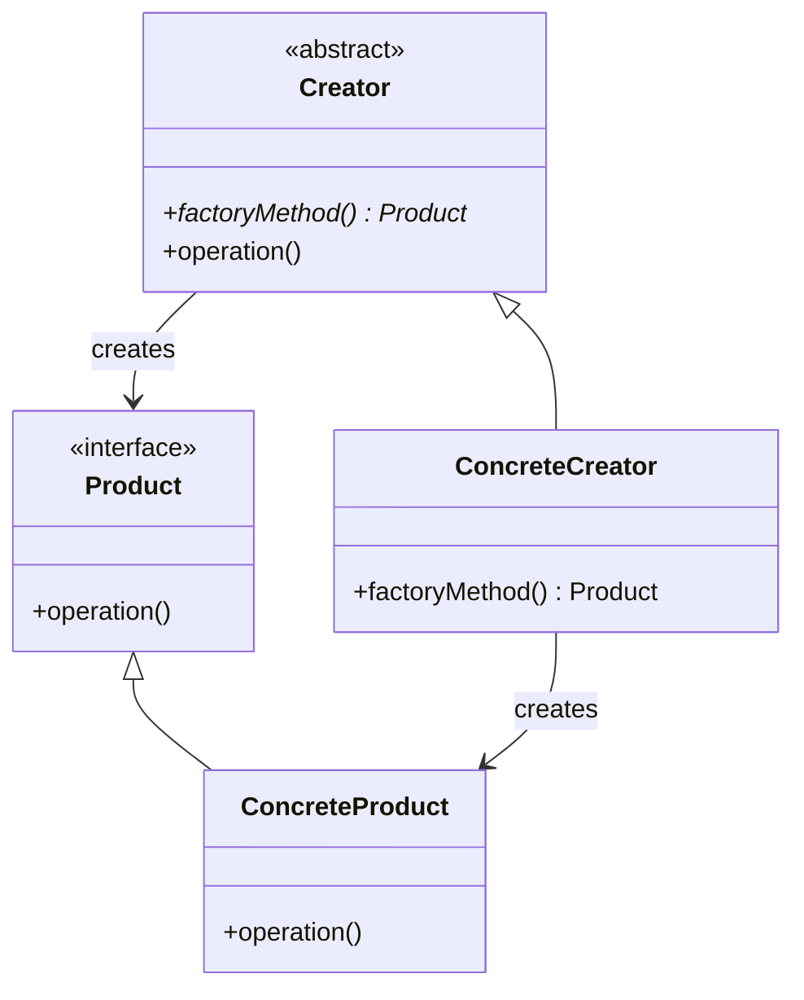

# 🏭 Factory Method Pattern

## 📋 Definición

El patrón **Factory Method** proporciona una interfaz para crear objetos en una superclase, pero permite a las subclases alterar el tipo de objetos que se crearán.

## 🎯 Propósito

- **Desacoplar** la creación de objetos de su uso
- **Permitir** que las subclases decidan qué clase instanciar
- **Proporcionar** una interfaz común para crear objetos
- **Facilitar** la extensión con nuevos tipos de productos

## 🔍 Cuándo Usar

### ✅ **Situaciones Apropiadas:**
- **Crear objetos** sin conocer su clase exacta
- **Diferentes tipos** de productos según el contexto
- **Extensibilidad** con nuevos tipos de productos
- **Configuración** de objetos según parámetros
- **Lazy initialization** de objetos costosos

### ❌ **Cuándo NO usar:**
- Cuando solo hay un tipo de producto
- Cuando la creación es simple y directa
- Cuando no necesitas extensibilidad

---

## 🏗️ Estructura del Patrón

### 📊 Diagrama UML



### 🔧 Componentes

1. **Creator**: Clase abstracta que define el factory method
2. **ConcreteCreator**: Implementación específica del factory method
3. **Product**: Interface para los productos creados
4. **ConcreteProduct**: Implementación específica del producto

---

## 💻 Implementación en C++

### 🔧 **Implementación Básica**

```cpp
#include <memory>
#include <string>
#include <iostream>

// Product interface
class Document {
public:
    virtual ~Document() = default;
    virtual void open() = 0;
    virtual void save() = 0;
    virtual void close() = 0;
};

// Concrete Products
class PDFDocument : public Document {
public:
    void open() override {
        std::cout << "Opening PDF document" << std::endl;
    }
    
    void save() override {
        std::cout << "Saving PDF document" << std::endl;
    }
    
    void close() override {
        std::cout << "Closing PDF document" << std::endl;
    }
};

class WordDocument : public Document {
public:
    void open() override {
        std::cout << "Opening Word document" << std::endl;
    }
    
    void save() override {
        std::cout << "Saving Word document" << std::endl;
    }
    
    void close() override {
        std::cout << "Closing Word document" << std::endl;
    }
};

class TextDocument : public Document {
public:
    void open() override {
        std::cout << "Opening Text document" << std::endl;
    }
    
    void save() override {
        std::cout << "Saving Text document" << std::endl;
    }
    
    void close() override {
        std::cout << "Closing Text document" << std::endl;
    }
};

// Creator interface
class DocumentCreator {
public:
    virtual ~DocumentCreator() = default;
    virtual std::unique_ptr<Document> createDocument() = 0;
    
    void processDocument() {
        auto doc = createDocument();
        doc->open();
        doc->save();
        doc->close();
    }
};

// Concrete Creators
class PDFCreator : public DocumentCreator {
public:
    std::unique_ptr<Document> createDocument() override {
        return std::make_unique<PDFDocument>();
    }
};

class WordCreator : public DocumentCreator {
public:
    std::unique_ptr<Document> createDocument() override {
        return std::make_unique<WordDocument>();
    }
};

class TextCreator : public DocumentCreator {
public:
    std::unique_ptr<Document> createDocument() override {
        return std::make_unique<TextDocument>();
    }
};
```

### 🚀 **Implementación con Parámetros**

```cpp
// Factory Method con parámetros
class DocumentFactory {
public:
    enum DocumentType {
        PDF,
        WORD,
        TEXT
    };
    
    static std::unique_ptr<Document> createDocument(DocumentType type) {
        switch (type) {
            case PDF:
                return std::make_unique<PDFDocument>();
            case WORD:
                return std::make_unique<WordDocument>();
            case TEXT:
                return std::make_unique<TextDocument>();
            default:
                throw std::invalid_argument("Unknown document type");
        }
    }
    
    static std::unique_ptr<Document> createDocument(const std::string& filename) {
        std::string extension = getFileExtension(filename);
        
        if (extension == "pdf") {
            return std::make_unique<PDFDocument>();
        } else if (extension == "docx" || extension == "doc") {
            return std::make_unique<WordDocument>();
        } else if (extension == "txt") {
            return std::make_unique<TextDocument>();
        } else {
            throw std::invalid_argument("Unsupported file type: " + extension);
        }
    }
    
private:
    static std::string getFileExtension(const std::string& filename) {
        size_t dotPos = filename.find_last_of('.');
        if (dotPos == std::string::npos) {
            return "";
        }
        return filename.substr(dotPos + 1);
    }
};
```

### 🔧 **Implementación con Template**

```cpp
template<typename T>
class DocumentFactoryTemplate {
public:
    static std::unique_ptr<Document> createDocument() {
        return std::make_unique<T>();
    }
};

// Uso con template
auto pdfDoc = DocumentFactoryTemplate<PDFDocument>::createDocument();
auto wordDoc = DocumentFactoryTemplate<WordDocument>::createDocument();
```

---

## 🎯 Ejemplos Prácticos

### 🎮 **Sistema de Juegos**

```cpp
// Game Object hierarchy
class GameObject {
public:
    virtual ~GameObject() = default;
    virtual void update() = 0;
    virtual void render() = 0;
    virtual void destroy() = 0;
};

class Player : public GameObject {
public:
    void update() override {
        std::cout << "Player updating..." << std::endl;
    }
    
    void render() override {
        std::cout << "Rendering player..." << std::endl;
    }
    
    void destroy() override {
        std::cout << "Player destroyed" << std::endl;
    }
};

class Enemy : public GameObject {
public:
    void update() override {
        std::cout << "Enemy updating..." << std::endl;
    }
    
    void render() override {
        std::cout << "Rendering enemy..." << std::endl;
    }
    
    void destroy() override {
        std::cout << "Enemy destroyed" << std::endl;
    }
};

class PowerUp : public GameObject {
public:
    void update() override {
        std::cout << "PowerUp updating..." << std::endl;
    }
    
    void render() override {
        std::cout << "Rendering powerup..." << std::endl;
    }
    
    void destroy() override {
        std::cout << "PowerUp destroyed" << std::endl;
    }
};

// Game Object Factory
class GameObjectFactory {
public:
    enum ObjectType {
        PLAYER,
        ENEMY,
        POWERUP
    };
    
    static std::unique_ptr<GameObject> createObject(ObjectType type) {
        switch (type) {
            case PLAYER:
                return std::make_unique<Player>();
            case ENEMY:
                return std::make_unique<Enemy>();
            case POWERUP:
                return std::make_unique<PowerUp>();
            default:
                throw std::invalid_argument("Unknown object type");
        }
    }
    
    static std::unique_ptr<GameObject> createObject(const std::string& typeName) {
        if (typeName == "player") {
            return std::make_unique<Player>();
        } else if (typeName == "enemy") {
            return std::make_unique<Enemy>();
        } else if (typeName == "powerup") {
            return std::make_unique<PowerUp>();
        } else {
            throw std::invalid_argument("Unknown object type: " + typeName);
        }
    }
};
```

### 🏦 **Sistema de Cuentas Bancarias**

```cpp
// Account hierarchy
class Account {
public:
    virtual ~Account() = default;
    virtual void deposit(double amount) = 0;
    virtual void withdraw(double amount) = 0;
    virtual double getBalance() const = 0;
    virtual std::string getType() const = 0;
};

class SavingsAccount : public Account {
private:
    double balance;
    double interestRate;
    
public:
    SavingsAccount(double initialBalance, double rate) 
        : balance(initialBalance), interestRate(rate) {}
    
    void deposit(double amount) override {
        balance += amount;
        std::cout << "Deposited $" << amount << " to savings account" << std::endl;
    }
    
    void withdraw(double amount) override {
        if (amount <= balance) {
            balance -= amount;
            std::cout << "Withdrew $" << amount << " from savings account" << std::endl;
        } else {
            std::cout << "Insufficient funds in savings account" << std::endl;
        }
    }
    
    double getBalance() const override {
        return balance;
    }
    
    std::string getType() const override {
        return "Savings Account";
    }
};

class CheckingAccount : public Account {
private:
    double balance;
    double overdraftLimit;
    
public:
    CheckingAccount(double initialBalance, double limit) 
        : balance(initialBalance), overdraftLimit(limit) {}
    
    void deposit(double amount) override {
        balance += amount;
        std::cout << "Deposited $" << amount << " to checking account" << std::endl;
    }
    
    void withdraw(double amount) override {
        if (amount <= balance + overdraftLimit) {
            balance -= amount;
            std::cout << "Withdrew $" << amount << " from checking account" << std::endl;
        } else {
            std::cout << "Withdrawal exceeds overdraft limit" << std::endl;
        }
    }
    
    double getBalance() const override {
        return balance;
    }
    
    std::string getType() const override {
        return "Checking Account";
    }
};

// Account Factory
class AccountFactory {
public:
    enum AccountType {
        SAVINGS,
        CHECKING
    };
    
    static std::unique_ptr<Account> createAccount(AccountType type, double initialBalance) {
        switch (type) {
            case SAVINGS:
                return std::make_unique<SavingsAccount>(initialBalance, 0.02);
            case CHECKING:
                return std::make_unique<CheckingAccount>(initialBalance, 500.0);
            default:
                throw std::invalid_argument("Unknown account type");
        }
    }
    
    static std::unique_ptr<Account> createAccount(const std::string& typeName, double initialBalance) {
        if (typeName == "savings") {
            return std::make_unique<SavingsAccount>(initialBalance, 0.02);
        } else if (typeName == "checking") {
            return std::make_unique<CheckingAccount>(initialBalance, 500.0);
        } else {
            throw std::invalid_argument("Unknown account type: " + typeName);
        }
    }
};
```

---

## ⚠️ Problemas y Soluciones

### 🚨 **Problemas Comunes**

#### 1. **Violación del Open/Closed Principle**
```cpp
// ❌ PROBLEMA: Modificar factory para nuevos tipos
class DocumentFactory {
    static std::unique_ptr<Document> createDocument(const std::string& type) {
        if (type == "pdf") {
            return std::make_unique<PDFDocument>();
        } else if (type == "word") {
            return std::make_unique<WordDocument>();
        } else if (type == "excel") {  // Nuevo tipo requiere modificar
            return std::make_unique<ExcelDocument>();
        }
        throw std::invalid_argument("Unknown type");
    }
};

// ✅ SOLUCIÓN: Registry pattern
class DocumentFactory {
private:
    static std::map<std::string, std::function<std::unique_ptr<Document>()>> creators;
    
public:
    static void registerCreator(const std::string& type, 
                               std::function<std::unique_ptr<Document>()> creator) {
        creators[type] = creator;
    }
    
    static std::unique_ptr<Document> createDocument(const std::string& type) {
        auto it = creators.find(type);
        if (it != creators.end()) {
            return it->second();
        }
        throw std::invalid_argument("Unknown type: " + type);
    }
};

// Registro de tipos
DocumentFactory::registerCreator("pdf", []() { return std::make_unique<PDFDocument>(); });
DocumentFactory::registerCreator("word", []() { return std::make_unique<WordDocument>(); });
```

#### 2. **Dependencias Circulares**
```cpp
// ❌ PROBLEMA: Dependencia circular
class A {
    std::unique_ptr<B> createB() { return std::make_unique<B>(); }
};

class B {
    std::unique_ptr<A> createA() { return std::make_unique<A>(); }
};

// ✅ SOLUCIÓN: Dependency Injection
class A {
    std::unique_ptr<B> b;
public:
    A(std::unique_ptr<B> b) : b(std::move(b)) {}
};

class B {
    std::unique_ptr<A> a;
public:
    B(std::unique_ptr<A> a) : a(std::move(a)) {}
};
```

#### 3. **Memory Management**
```cpp
// ❌ PROBLEMA: Raw pointers
class DocumentFactory {
    static Document* createDocument(const std::string& type) {
        if (type == "pdf") {
            return new PDFDocument();  // Memory leak si no se libera
        }
        return nullptr;
    }
};

// ✅ SOLUCIÓN: Smart pointers
class DocumentFactory {
    static std::unique_ptr<Document> createDocument(const std::string& type) {
        if (type == "pdf") {
            return std::make_unique<PDFDocument>();  // RAII
        }
        throw std::invalid_argument("Unknown type");
    }
};
```

---

## 🎯 Ventajas y Desventajas

### ✅ **Ventajas:**
- **Desacoplamiento**: Cliente no conoce clases concretas
- **Extensibilidad**: Fácil añadir nuevos tipos
- **Flexibilidad**: Creación basada en parámetros
- **Reutilización**: Lógica de creación centralizada

### ❌ **Desventajas:**
- **Complejidad**: Puede ser excesiva para casos simples
- **Acoplamiento**: Factory conoce todas las clases concretas
- **Performance**: Overhead de creación de objetos
- **Testing**: Difícil de mockear

---

## 🧪 Testing con Factory Method

### 🔧 **Mocking Products**

```cpp
// Mock Product para testing
class MockDocument : public Document {
public:
    MOCK_METHOD(void, open, (), (override));
    MOCK_METHOD(void, save, (), (override));
    MOCK_METHOD(void, close, (), (override));
};

// Test
TEST(FactoryMethod, CreateDocument) {
    auto factory = std::make_unique<PDFCreator>();
    auto document = factory->createDocument();
    
    EXPECT_NE(document, nullptr);
    EXPECT_TRUE(dynamic_cast<PDFDocument*>(document.get()) != nullptr);
}
```

---

## 🚀 Alternativas al Factory Method

### 1. **Abstract Factory**
```cpp
class DocumentFactory {
public:
    virtual std::unique_ptr<Document> createDocument() = 0;
    virtual std::unique_ptr<Document> createSpreadsheet() = 0;
    virtual std::unique_ptr<Document> createPresentation() = 0;
};
```

### 2. **Builder Pattern**
```cpp
class DocumentBuilder {
public:
    DocumentBuilder& setType(const std::string& type) {
        this->type = type;
        return *this;
    }
    
    DocumentBuilder& setTitle(const std::string& title) {
        this->title = title;
        return *this;
    }
    
    std::unique_ptr<Document> build() {
        if (type == "pdf") {
            return std::make_unique<PDFDocument>(title);
        }
        throw std::invalid_argument("Unknown type");
    }
};
```

### 3. **Dependency Injection**
```cpp
class DocumentProcessor {
private:
    std::function<std::unique_ptr<Document>()> documentFactory;
    
public:
    DocumentProcessor(std::function<std::unique_ptr<Document>()> factory) 
        : documentFactory(factory) {}
    
    void processDocument() {
        auto doc = documentFactory();
        doc->open();
        doc->save();
        doc->close();
    }
};
```

---

## 🎯 Cuándo Usar Factory Method en 42

### ✅ **Proyectos Apropiados:**
- **Cub3D**: Crear diferentes tipos de objetos del juego
- **Philosophers**: Crear diferentes tipos de filósofos
- **Minishell**: Crear diferentes tipos de comandos
- **Webserv**: Crear diferentes tipos de handlers

### ❌ **Proyectos Inapropiados:**
- **Libft**: Funciones de utilidad
- **Get Next Line**: Lectura de archivos
- **Printf**: Formateo de strings

---

## 📚 Recursos Adicionales

### 📖 **Lecturas Recomendadas:**
- [Refactoring Guru - Factory Method](https://refactoring.guru/es/design-patterns/factory-method)
- [Modern C++ Design](https://www.oreilly.com/library/view/modern-c-design/0201704315/)
- [C++ Core Guidelines](https://isocpp.github.io/CppCoreGuidelines/)

### 🎯 **Próximos Pasos:**
1. Implementa un factory para diferentes tipos de archivos
2. Crea un factory para objetos de juego
3. Prueba con diferentes parámetros de creación
4. Estudia alternativas como Abstract Factory

---

*El Factory Method es esencial para crear sistemas flexibles y extensibles. ¡Úsalo para desacoplar la creación de objetos! 🏭*
