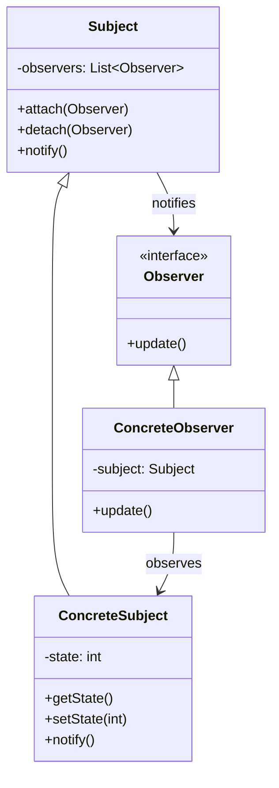

# 👁️ Observer Pattern

## 📋 Definición

El patrón **Observer** define una dependencia uno-a-muchos entre objetos, de manera que cuando un objeto cambia de estado, todos sus dependientes son notificados y actualizados automáticamente.

## 🎯 Propósito

- **Desacoplar** el sujeto de sus observadores
- **Notificar cambios** automáticamente
- **Mantener consistencia** entre objetos relacionados
- **Permitir comunicación** flexible entre objetos

## 🔍 Cuándo Usar

### ✅ **Situaciones Apropiadas:**
- **Model-View-Controller (MVC)**: Notificar cambios del modelo a las vistas
- **Eventos de UI**: Botones, formularios, menús
- **Sistema de notificaciones**: Email, SMS, push notifications
- **Logging**: Múltiples loggers para diferentes eventos
- **Caching**: Invalidar cache cuando cambian los datos

### ❌ **Cuándo NO usar:**
- Cuando hay pocos observadores (1-2)
- Cuando la comunicación es síncrona y simple
- Cuando el acoplamiento es aceptable

---

## 🏗️ Estructura del Patrón

### 📊 Diagrama UML



### 🔧 Componentes

1. **Subject (Sujeto)**: Mantiene lista de observadores y notifica cambios
2. **Observer (Observador)**: Interface para objetos que deben ser notificados
3. **ConcreteSubject**: Implementación específica del sujeto
4. **ConcreteObserver**: Implementación específica del observador

---

## 💻 Implementación en C++

### 🔧 **Implementación Básica**

```cpp
#include <vector>
#include <memory>
#include <iostream>

// Interface Observer
class Observer {
public:
    virtual ~Observer() = default;
    virtual void update() = 0;
};

// Clase Subject
class Subject {
protected:
    std::vector<std::weak_ptr<Observer>> observers;
    
public:
    void attach(std::shared_ptr<Observer> observer) {
        observers.push_back(observer);
    }
    
    void detach(std::shared_ptr<Observer> observer) {
        observers.erase(
            std::remove_if(observers.begin(), observers.end(),
                [&](const std::weak_ptr<Observer>& weak_obs) {
                    return weak_obs.expired() || weak_obs.lock() == observer;
                }),
            observers.end()
        );
    }
    
    void notify() {
        for (auto it = observers.begin(); it != observers.end();) {
            if (auto observer = it->lock()) {
                observer->update();
                ++it;
            } else {
                it = observers.erase(it);
            }
        }
    }
};

// ConcreteSubject
class WeatherStation : public Subject {
private:
    int temperature;
    int humidity;
    int pressure;
    
public:
    void setMeasurements(int temp, int hum, int press) {
        temperature = temp;
        humidity = hum;
        pressure = press;
        notify(); // Notificar a todos los observadores
    }
    
    int getTemperature() const { return temperature; }
    int getHumidity() const { return humidity; }
    int getPressure() const { return pressure; }
};

// ConcreteObserver
class Display : public Observer {
private:
    std::weak_ptr<WeatherStation> weatherStation;
    
public:
    Display(std::shared_ptr<WeatherStation> station) 
        : weatherStation(station) {}
    
    void update() override {
        if (auto station = weatherStation.lock()) {
            std::cout << "Display - Temperature: " << station->getTemperature()
                      << "°C, Humidity: " << station->getHumidity()
                      << "%, Pressure: " << station->getPressure() << "hPa" << std::endl;
        }
    }
};

class PhoneApp : public Observer {
private:
    std::weak_ptr<WeatherStation> weatherStation;
    
public:
    PhoneApp(std::shared_ptr<WeatherStation> station) 
        : weatherStation(station) {}
    
    void update() override {
        if (auto station = weatherStation.lock()) {
            std::cout << "Phone App - Weather Alert: " 
                      << station->getTemperature() << "°C" << std::endl;
        }
    }
};
```

### 🚀 **Implementación con Eventos Específicos**

```cpp
#include <functional>
#include <map>
#include <vector>

// Eventos específicos
enum class EventType {
    TEMPERATURE_CHANGED,
    HUMIDITY_CHANGED,
    PRESSURE_CHANGED
};

// Observer con eventos específicos
class EventObserver {
public:
    virtual ~EventObserver() = default;
    virtual void onEvent(EventType event, const std::string& data) = 0;
};

// Subject con eventos específicos
class EventSubject {
private:
    std::map<EventType, std::vector<std::weak_ptr<EventObserver>>> observers;
    
public:
    void attach(EventType event, std::shared_ptr<EventObserver> observer) {
        observers[event].push_back(observer);
    }
    
    void detach(EventType event, std::shared_ptr<EventObserver> observer) {
        auto& eventObservers = observers[event];
        eventObservers.erase(
            std::remove_if(eventObservers.begin(), eventObservers.end(),
                [&](const std::weak_ptr<EventObserver>& weak_obs) {
                    return weak_obs.expired() || weak_obs.lock() == observer;
                }),
            eventObservers.end()
        );
    }
    
    void notify(EventType event, const std::string& data) {
        if (observers.find(event) != observers.end()) {
            for (auto it = observers[event].begin(); it != observers[event].end();) {
                if (auto observer = it->lock()) {
                    observer->onEvent(event, data);
                    ++it;
                } else {
                    it = observers[event].erase(it);
                }
            }
        }
    }
};

// Implementación específica
class SmartHome : public EventSubject {
private:
    int temperature;
    int humidity;
    int pressure;
    
public:
    void setTemperature(int temp) {
        temperature = temp;
        notify(EventType::TEMPERATURE_CHANGED, std::to_string(temp));
    }
    
    void setHumidity(int hum) {
        humidity = hum;
        notify(EventType::HUMIDITY_CHANGED, std::to_string(hum));
    }
    
    void setPressure(int press) {
        pressure = press;
        notify(EventType::PRESSURE_CHANGED, std::to_string(press));
    }
};
```

---

## 🎯 Ejemplos Prácticos

### 📱 **Sistema de Notificaciones**

```cpp
class NotificationSystem {
private:
    std::vector<std::shared_ptr<Observer>> observers;
    
public:
    void subscribe(std::shared_ptr<Observer> observer) {
        observers.push_back(observer);
    }
    
    void unsubscribe(std::shared_ptr<Observer> observer) {
        observers.erase(
            std::remove(observers.begin(), observers.end(), observer),
            observers.end()
        );
    }
    
    void sendNotification(const std::string& message) {
        for (auto& observer : observers) {
            observer->update();
        }
    }
};

class EmailNotifier : public Observer {
public:
    void update() override {
        std::cout << "Email sent: New notification received" << std::endl;
    }
};

class SMSNotifier : public Observer {
public:
    void update() override {
        std::cout << "SMS sent: New notification received" << std::endl;
    }
};

class PushNotifier : public Observer {
public:
    void update() override {
        std::cout << "Push notification sent" << std::endl;
    }
};
```

### 🎮 **Sistema de Eventos en Juego**

```cpp
class GameEvent {
public:
    enum Type { PLAYER_MOVED, ENEMY_DIED, ITEM_PICKED_UP };
    Type type;
    std::string data;
    
    GameEvent(Type t, const std::string& d) : type(t), data(d) {}
};

class GameObserver {
public:
    virtual ~GameObserver() = default;
    virtual void onGameEvent(const GameEvent& event) = 0;
};

class GameEngine {
private:
    std::vector<std::shared_ptr<GameObserver>> observers;
    
public:
    void addObserver(std::shared_ptr<GameObserver> observer) {
        observers.push_back(observer);
    }
    
    void removeObserver(std::shared_ptr<GameObserver> observer) {
        observers.erase(
            std::remove(observers.begin(), observers.end(), observer),
            observers.end()
        );
    }
    
    void triggerEvent(const GameEvent& event) {
        for (auto& observer : observers) {
            observer->onGameEvent(event);
        }
    }
};

class ScoreSystem : public GameObserver {
private:
    int score;
    
public:
    void onGameEvent(const GameEvent& event) override {
        switch (event.type) {
            case GameEvent::ENEMY_DIED:
                score += 100;
                std::cout << "Score: " << score << std::endl;
                break;
            case GameEvent::ITEM_PICKED_UP:
                score += 50;
                std::cout << "Score: " << score << std::endl;
                break;
            default:
                break;
        }
    }
};

class SoundSystem : public GameObserver {
public:
    void onGameEvent(const GameEvent& event) override {
        switch (event.type) {
            case GameEvent::ENEMY_DIED:
                std::cout << "Playing enemy death sound" << std::endl;
                break;
            case GameEvent::ITEM_PICKED_UP:
                std::cout << "Playing item pickup sound" << std::endl;
                break;
            default:
                break;
        }
    }
};
```

---

## ⚠️ Problemas y Soluciones

### 🚨 **Problemas Comunes**

#### 1. **Memory Leaks con Raw Pointers**
```cpp
// ❌ PROBLEMA: Memory leaks
class Subject {
    std::vector<Observer*> observers;  // Raw pointers
public:
    void attach(Observer* observer) {
        observers.push_back(observer);
    }
    // ¿Quién libera la memoria?
};

// ✅ SOLUCIÓN: Smart pointers
class Subject {
    std::vector<std::weak_ptr<Observer>> observers;
public:
    void attach(std::shared_ptr<Observer> observer) {
        observers.push_back(observer);
    }
};
```

#### 2. **Observadores Muertos (Dangling Pointers)**
```cpp
// ❌ PROBLEMA: Observadores muertos
void notify() {
    for (auto* observer : observers) {
        observer->update();  // Crash si observer fue destruido
    }
}

// ✅ SOLUCIÓN: Verificar con weak_ptr
void notify() {
    for (auto it = observers.begin(); it != observers.end();) {
        if (auto observer = it->lock()) {
            observer->update();
            ++it;
        } else {
            it = observers.erase(it);  // Eliminar observadores muertos
        }
    }
}
```

#### 3. **Notificaciones Circulares**
```cpp
// ❌ PROBLEMA: Notificación circular
class A : public Observer {
    void update() override {
        // A notifica a B, B notifica a A = bucle infinito
    }
};

// ✅ SOLUCIÓN: Flags de notificación
class A : public Observer {
private:
    bool updating = false;
public:
    void update() override {
        if (updating) return;  // Evitar recursión
        updating = true;
        // Lógica de actualización
        updating = false;
    }
};
```

---

## 🎯 Ventajas y Desventajas

### ✅ **Ventajas:**
- **Desacoplamiento**: Sujeto y observadores son independientes
- **Extensibilidad**: Fácil añadir nuevos observadores
- **Flexibilidad**: Observadores pueden ser añadidos/removidos dinámicamente
- **Reutilización**: Observadores pueden ser reutilizados

### ❌ **Desventajas:**
- **Complejidad**: Puede ser difícil de entender
- **Performance**: Notificaciones pueden ser costosas
- **Memory leaks**: Si no se maneja correctamente
- **Debugging**: Difícil rastrear el flujo de notificaciones

---

## 🧪 Testing con Observer

### 🔧 **Mocking Observers**

```cpp
// Mock Observer para testing
class MockObserver : public Observer {
public:
    MOCK_METHOD(void, update, (), (override));
    MOCK_METHOD(void, update, (const std::string&), (override));
};

// Test
TEST(ObserverPattern, NotifyObservers) {
    auto subject = std::make_shared<WeatherStation>();
    auto observer1 = std::make_shared<MockObserver>();
    auto observer2 = std::make_shared<MockObserver>();
    
    subject->attach(observer1);
    subject->attach(observer2);
    
    EXPECT_CALL(*observer1, update()).Times(1);
    EXPECT_CALL(*observer2, update()).Times(1);
    
    subject->setMeasurements(25, 60, 1013);
}
```

---

## 🚀 Alternativas al Observer

### 1. **Event Bus**
```cpp
class EventBus {
private:
    std::map<std::string, std::vector<std::function<void()>>> handlers;
    
public:
    void subscribe(const std::string& event, std::function<void()> handler) {
        handlers[event].push_back(handler);
    }
    
    void publish(const std::string& event) {
        for (auto& handler : handlers[event]) {
            handler();
        }
    }
};
```

### 2. **Reactive Programming**
```cpp
#include <rx/rx.hpp>

auto observable = rxcpp::observable<>::create<int>(
    [](rxcpp::subscriber<int> s) {
        s.on_next(1);
        s.on_next(2);
        s.on_completed();
    }
);

observable.subscribe(
    [](int value) { std::cout << value << std::endl; },
    [](std::exception_ptr ep) { std::cout << "Error" << std::endl; },
    []() { std::cout << "Completed" << std::endl; }
);
```

---

## 🎯 Cuándo Usar Observer en 42

### ✅ **Proyectos Apropiados:**
- **Cub3D**: Sistema de eventos del juego
- **Philosophers**: Notificaciones de estado
- **Minishell**: Historial de comandos
- **Webserv**: Logging y monitoreo

### ❌ **Proyectos Inapropiados:**
- **Libft**: Funciones de utilidad
- **Get Next Line**: Lectura de archivos
- **Printf**: Formateo de strings

---

## 📚 Recursos Adicionales

### 📖 **Lecturas Recomendadas:**
- [Refactoring Guru - Observer](https://refactoring.guru/es/design-patterns/observer)
- [Modern C++ Design](https://www.oreilly.com/library/view/modern-c-design/0201704315/)
- [Reactive Programming](https://reactivex.io/)

### 🎯 **Próximos Pasos:**
1. Implementa un sistema de notificaciones
2. Crea un sistema de eventos para un juego
3. Prueba con diferentes tipos de observadores
4. Estudia alternativas como Event Bus

---

*El Observer es fundamental para sistemas desacoplados y flexibles. ¡Úsalo para crear arquitecturas robustas! 🎯*
