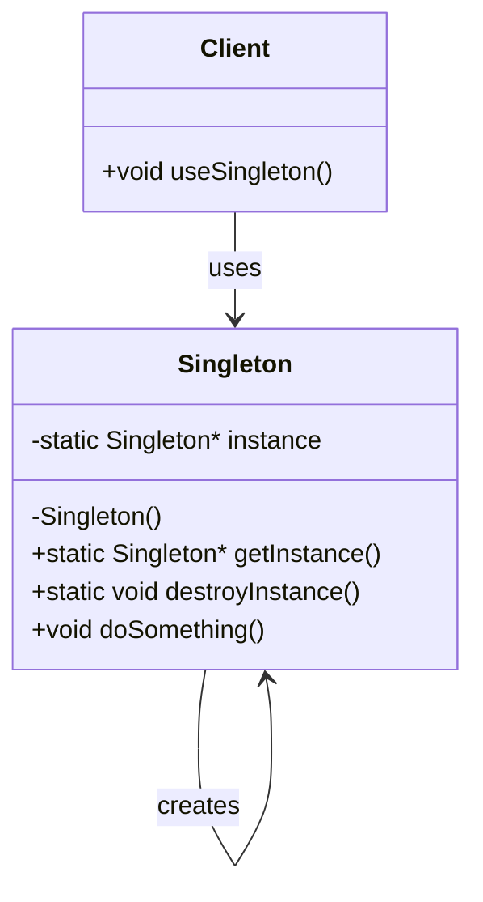

# 🏆 Singleton Pattern

## 📋 Definición

El patrón **Singleton** garantiza que una clase tenga exactamente una instancia y proporciona un punto de acceso global a ella.

## 🎯 Propósito

- **Garantizar una única instancia** de una clase
- **Proporcionar acceso global** a esa instancia
- **Controlar la creación** de objetos

## 🔍 Cuándo Usar

### ✅ **Situaciones Apropiadas:**
- **Logger**: Un solo logger para toda la aplicación
- **Configuración**: Una sola configuración global
- **Conexión a BD**: Una sola conexión compartida
- **Cache**: Un solo cache para toda la aplicación
- **Thread Pool**: Un solo pool de hilos

### ❌ **Cuándo NO usar:**
- Cuando necesitas múltiples instancias
- Cuando la clase es stateless
- Cuando la dependencia global es problemática

---

## 🏗️ Estructura del Patrón

### 📊 Diagrama UML



### 🔧 Componentes

1. **Constructor privado**: Evita instanciación directa
2. **Instancia estática**: Almacena la única instancia
3. **Método getInstance()**: Proporciona acceso controlado
4. **Método destroyInstance()**: Libera la instancia (opcional)

---

## 💻 Implementación en C++

### 🔧 **Versión Básica (No Thread-Safe)**

```cpp
class Singleton {
private:
    static Singleton* instance;
    Singleton() = default;  // Constructor privado
    
public:
    // Eliminar constructor de copia y asignación
    Singleton(const Singleton&) = delete;
    Singleton& operator=(const Singleton&) = delete;
    
    static Singleton* getInstance() {
        if (instance == nullptr) {
            instance = new Singleton();
        }
        return instance;
    }
    
    void doSomething() {
        std::cout << "Singleton is working!" << std::endl;
    }
    
    static void destroyInstance() {
        delete instance;
        instance = nullptr;
    }
};

// Inicialización estática
Singleton* Singleton::instance = nullptr;
```

### 🚀 **Versión Thread-Safe (C++11+)**

```cpp
class Singleton {
private:
    Singleton() = default;
    
public:
    Singleton(const Singleton&) = delete;
    Singleton& operator=(const Singleton&) = delete;
    
    static Singleton& getInstance() {
        static Singleton instance;  // Thread-safe desde C++11
        return instance;
    }
    
    void doSomething() {
        std::cout << "Thread-safe Singleton!" << std::endl;
    }
};
```

### 🔒 **Versión con Mutex (Thread-Safe Manual)**

```cpp
#include <mutex>

class Singleton {
private:
    static Singleton* instance;
    static std::mutex mtx;
    Singleton() = default;
    
public:
    Singleton(const Singleton&) = delete;
    Singleton& operator=(const Singleton&) = delete;
    
    static Singleton* getInstance() {
        std::lock_guard<std::mutex> lock(mtx);
        if (instance == nullptr) {
            instance = new Singleton();
        }
        return instance;
    }
    
    void doSomething() {
        std::cout << "Mutex-protected Singleton!" << std::endl;
    }
};

Singleton* Singleton::instance = nullptr;
std::mutex Singleton::mtx;
```

---

## 🎯 Ejemplos Prácticos

### 📝 **Logger Singleton**

```cpp
class Logger {
private:
    static Logger* instance;
    std::ofstream logFile;
    
    Logger() {
        logFile.open("application.log", std::ios::app);
    }
    
public:
    static Logger& getInstance() {
        static Logger instance;
        return instance;
    }
    
    void log(const std::string& message) {
        logFile << "[" << getCurrentTime() << "] " << message << std::endl;
    }
    
    ~Logger() {
        if (logFile.is_open()) {
            logFile.close();
        }
    }
    
private:
    std::string getCurrentTime() {
        auto now = std::chrono::system_clock::now();
        auto time_t = std::chrono::system_clock::to_time_t(now);
        return std::ctime(&time_t);
    }
};

// Uso
Logger::getInstance().log("Application started");
Logger::getInstance().log("User logged in");
```

### ⚙️ **Configuración Singleton**

```cpp
class Config {
private:
    static Config* instance;
    std::map<std::string, std::string> settings;
    
    Config() {
        loadFromFile("config.ini");
    }
    
public:
    static Config& getInstance() {
        static Config instance;
        return instance;
    }
    
    std::string getValue(const std::string& key) {
        auto it = settings.find(key);
        return (it != settings.end()) ? it->second : "";
    }
    
    void setValue(const std::string& key, const std::string& value) {
        settings[key] = value;
    }
    
private:
    void loadFromFile(const std::string& filename) {
        // Cargar configuración desde archivo
        settings["database_url"] = "localhost:3306";
        settings["max_connections"] = "100";
    }
};

// Uso
std::string dbUrl = Config::getInstance().getValue("database_url");
```

---

## ⚠️ Problemas y Soluciones

### 🚨 **Problemas Comunes**

#### 1. **Thread Safety**
```cpp
// ❌ PROBLEMA: No thread-safe
static Singleton* getInstance() {
    if (instance == nullptr) {  // Race condition aquí
        instance = new Singleton();
    }
    return instance;
}

// ✅ SOLUCIÓN: Thread-safe
static Singleton& getInstance() {
    static Singleton instance;  // Thread-safe desde C++11
    return instance;
}
```

#### 2. **Memory Leaks**
```cpp
// ❌ PROBLEMA: No se libera memoria
static Singleton* getInstance() {
    if (instance == nullptr) {
        instance = new Singleton();
    }
    return instance;
}

// ✅ SOLUCIÓN: RAII con smart pointers
static std::unique_ptr<Singleton> instance;

static Singleton& getInstance() {
    if (!instance) {
        instance = std::make_unique<Singleton>();
    }
    return *instance;
}
```

#### 3. **Dependencias Circulares**
```cpp
// ❌ PROBLEMA: Dependencia circular
class A {
    void useB() {
        B::getInstance().doSomething();
    }
};

class B {
    void useA() {
        A::getInstance().doSomething();
    }
};

// ✅ SOLUCIÓN: Dependency Injection
class A {
    B& b;
public:
    A(B& b) : b(b) {}
    void useB() { b.doSomething(); }
};
```

---

## 🎯 Ventajas y Desventajas

### ✅ **Ventajas:**
- **Control de instancias**: Garantiza una sola instancia
- **Acceso global**: Fácil acceso desde cualquier parte
- **Lazy initialization**: Se crea solo cuando se necesita
- **Thread-safe**: Con implementación correcta

### ❌ **Desventajas:**
- **Dependencia global**: Dificulta testing
- **Violación de SRP**: Puede acumular responsabilidades
- **Thread safety**: Requiere implementación cuidadosa
- **Testing**: Difícil de mockear en tests

---

## 🧪 Testing con Singleton

### 🔧 **Mocking Singleton**

```cpp
// Interface para testing
class ILogger {
public:
    virtual void log(const std::string& message) = 0;
    virtual ~ILogger() = default;
};

// Implementación real
class Logger : public ILogger {
private:
    static std::unique_ptr<ILogger> instance;
    
public:
    static ILogger& getInstance() {
        if (!instance) {
            instance = std::make_unique<Logger>();
        }
        return *instance;
    }
    
    static void setInstance(std::unique_ptr<ILogger> newInstance) {
        instance = std::move(newInstance);
    }
    
    void log(const std::string& message) override {
        std::cout << message << std::endl;
    }
};

// Test
class MockLogger : public ILogger {
public:
    void log(const std::string& message) override {
        loggedMessages.push_back(message);
    }
    
    std::vector<std::string> loggedMessages;
};

// En el test
MockLogger mockLogger;
Logger::setInstance(std::make_unique<MockLogger>(mockLogger));
```

---

## 🚀 Alternativas al Singleton

### 1. **Dependency Injection**
```cpp
class Service {
    Logger& logger;
public:
    Service(Logger& logger) : logger(logger) {}
    void doSomething() {
        logger.log("Service working");
    }
};
```

### 2. **Static Class**
```cpp
class Logger {
public:
    static void log(const std::string& message) {
        std::cout << message << std::endl;
    }
};
```

### 3. **Monostate Pattern**
```cpp
class Logger {
    static std::string logLevel;
public:
    void setLogLevel(const std::string& level) {
        logLevel = level;
    }
    std::string getLogLevel() const {
        return logLevel;
    }
};
```

---

## 🎯 Cuándo Usar Singleton en 42

### ✅ **Proyectos Apropiados:**
- **Cub3D**: Logger para debugging
- **Philosophers**: Configuración global
- **Minishell**: Historial de comandos
- **Webserv**: Configuración del servidor

### ❌ **Proyectos Inapropiados:**
- **Libft**: Funciones de utilidad
- **Get Next Line**: Funciones de lectura
- **Printf**: Funciones de formateo

---

## 📚 Recursos Adicionales

### 📖 **Lecturas Recomendadas:**
- [Refactoring Guru - Singleton](https://refactoring.guru/es/design-patterns/singleton)
- [C++ Core Guidelines](https://isocpp.github.io/CppCoreGuidelines/)
- [Modern C++ Design](https://www.oreilly.com/library/view/modern-c-design/0201704315/)

### 🎯 **Próximos Pasos:**
1. Implementa un Logger Singleton
2. Crea una configuración Singleton
3. Prueba thread safety
4. Estudia alternativas como Dependency Injection

---

*El Singleton es poderoso pero debe usarse con cuidado. ¡Úsalo sabiamente! 🎯*
